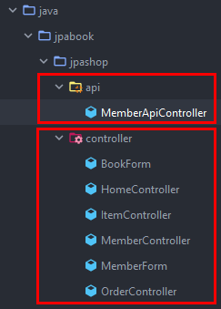

# section 1. API 개발 기본

# 1. 회원 등록 API



템플릿 엔진을 사용해서 렌더링하는 컨트롤러와 API 스타일의 컨트롤러의 패키지를 분리함.

왜 분리하냐면 공통으로 예외처리를 할 때 `패키지`, 혹은 `구성 단위` 로 공통처리를 많이 함.

그래서 `API` 랑 `화면` 은 공통처리해야될 요소가 다름.

화면은 템플릿 엔진에서 문제가 생기면 공통에러, 에러 HTML이 나와야 함. 근데 api는 공통 에러용 json api 스펙이 나가야함.  

이렇게 공통적인 관점에서 조금씩 차이가 있기 때문에 차라리 패키지를 분리하는게 낫다.

@RestController = @Controller + @ResponseBody (일반적인 rest api 스타일을 스프링이 제공)

여기서 @ResponseBody는 데이터자체를 json xml로 바꿀때 쓰는 어노테이션임.

(지금부터 api 통신은 xml 보단 json을 기준으로 얘기 하는 거임)

```java
@PostMapping("/api/v1/members")
public CreateMemberResponse saveMemberV1(@RequestBody @Valid Member member) {

}
```

@RequestBody는 json으로 온 body를 Member로 쫙 바꿔준다고 생각하면 됨.

위 방식의 문제점은

```java
@Entity
@Getter @Setter
public class Member {
    @Id @GeneratedValue
    @Column(name = "member_id")
    private Long id;

    @NotEmpty
    private String name;

    @Embedded
    private Address address;

    @OneToMany(mappedBy = "member")
    private List<Order> orders = new ArrayList<>();
}
```

이렇게 valid 체크할때 entity에다가 @NotEmpty 어노테이션을 붙여야 함. → presentation을 위한 검증 로직이 엔티티에 적용됨.

이렇게 되면 어떤 api에서는 name이 not empty인데, 어떤 api에서는 name이 empty여도 되는 상황이 생길 수 있음. 

그리고 만약 엔티티의 스펙을 바꿨다면? (예를들어 name명칭을 username으로 바꿨다면?) → api  스펙 자체가 바뀜. (결국 클라이언트에서 지금까지 되던게 갑자기  error가 뜨는 상황이 생기게 됨)

결국 위 처럼 엔티티를 presentation layer에서 사용하게 되면 엔티티를 변경했을때, api 스펙에도 문제가 발생하게 됨. (api스펙과 엔티티가 1:1로 딱 mapping 되어있는게 문제가 됨)

(엔티티는 굉장히 여러 곳에서 쓰이기 때문에 변경사항이 많음 그래서 얘를 api 스펙에 영향이 주는 presenation layer에서 주고 받는것은 바람직 하지 않음.)

그래서 결론적으로 `api스펙을 위한 별도의 data transfer object를 만들어야 함 (DTO)`

엔티티를 이렇게 외부에서 json으로 받아서 바인딩 받도록 하여 쓰면 안된다. → 나중에 큰 장애 발생됨.

> 엔티티를 외부로부터 받아서 바인딩도 하지말고, 외부로 노출시켜도 안된다.
> 

그래서 아래와 같이 dto를 따로 만들어서 controller를 만든다.

```java
@PostMapping("/api/v1/members")
publicCreateMemberResponse saveMemberV1(@RequestBody @Valid Member member) {
   Long id = memberService.join(member);
	 return newCreateMemberResponse(id);
}

@PostMapping("/api/v2/members")
publicCreateMemberResponse saveMemberV2(@RequestBody @Valid CreateMemberRequest request) {

   Member member =newMember();
   member.setName(request.getName());

   Long id = memberService.join(member);
   return newCreateMemberResponse(id);
}
```

v1에 비해 복잡해 짐. (v1의 유일한 장점은 CreateMemberRequest클래스를 안 만들어도 된다는 것임)

v2의 장점은 이제 member 엔티티가 변경되더라도 api 스펙은 변경되지 않음.

그리고 v1의 단점은 Member를 받아오는데, id를 받아도 되고 name을 받아도 되고 address를 받아도 되고orders를 받아도 되고 , 결국 멤버의 엔티티안에 있는 필드가 다 바인딩 되서 들어감.

그래서 개발자 입장에서는 멤버 엔티티를 까보지 않으면 도대체 어떤 값이 바인딩 되서 들어오는지 알 수 없다.

로직에 따라 api 스펙에서 이 4개의 값이 다 채워지는게 아니고, 서비스에서 채워질 수도 있는데, 이 Member엔티티 만으로는 알 수 없다.

근데 dto를 만들면, 정확하게 뭐를 받을건지 정해놓기 때문에 딱 id만 받겠다! 라고 정할 수 있다. 그리고 이 dto에 내가 필요한 validation또한 다 적용시키면 된다.

참고 : 엔티티에는 롬복을 getter만 제약해서 쓰지만, dto는 크게 로직이 있지 않아서 왠만하면 롬복 어노테이션을 잘 활용함 (getter, setter, allargsconstructor등등)

# 2. 회원 수정 API

```java
@PutMapping("/api/v2/members/{id}")
publicUpdateMemberResponse updateMemberV2(
      @PathVariable("id") Long id,
      @RequestBody @Valid UpdateMemberRequest request) {
   memberService.update(id, request.getName());
	 return newUpdateMemberResponse();
}
```

```java
@Transactional
public void update(Long id, String name) {
	Member member = memberRepository.findOne(id);
	member.setName(name);
}
```

변경 감지를 사용하여 데이터를 수정한다.

> 참고 : 위의 회원 수정 api인 updateMemberV2는 회원정보를 `부분` 업데이트 한다. 그리고 PUT 방식을 사용했는데, 사실 put은 `전체` 업데이트를 할 때 사용하는 것이 맞다. 부분 업데이트를 하려면 `PATCH` 를 사용하거나 `POST` 를 사용하는 것이 REST 스타일에 맞다.
> 

여기서 update로 나온 결과(Member)를 바로 return 해도 됨. 근데 굳이 Response dto를 만든 이유는 

`**커맨드**랑 **쿼리**를 철저히 분리 한다` 는 정책이 있다.

```java
@Transactional
public Member update(Long id, String name) {
	Member member = memberRepository.findOne(id);
	member.setName(name);
	return member;
}
```

그래서 위와같이 update 메서드가 Member를 return 하게 되면 커맨드랑 쿼리가 같이 있는 꼴이 된다. (update는 변경을 위한 메서드(`명령`)인데, 조회(`쿼리`)까지 해버리게 됨)

그래서 보통 update를 하면 

```java
@Transactional
public void update(Long id, String name) {
	Member member = memberRepository.findOne(id);
	member.setName(name);
}
```

이렇게만 하고 끝내는게 맞다. (아니면 찾은 member에 대한 id 값 정도만 반환해 준다.)

```java
@PutMapping("/api/v2/members/{id}")
public UpdateMemberResponse updateMemberV2(
		@PathVariable("id") Long id,
		@RequestBody @Valid UpdateMemberRequest request) {
	memberService.update(id, request.getName()); // 커맨드 (명령)
	Member findMember = memberService.findOne(id); // 쿼리 (조회)

	return new UpdateMemberResponse(findMember.getId(), findMember.getName());
}
```

그래서 이 커맨드, 쿼리 분리 정책을 지키면 다음과 같이 명령과 쿼리를 분리하여 로직을 짤 수 있다.

실제로 이렇게 쓰면 유지보수 성도 증대 된다.

# 회원 조회 API

```java
@GetMapping("/api/v1/members")
public List<Member> membersV1() {
	return memberService.findMembers();
}
```

이렇게 List로 respone를 주면 json array형식으로 response를 주기 때문에 api 스펙이 변경 될때 유연성이 떨어짐. (왜냐면 [] 안에는 동일한 데이터를 넣어야 하기 때문)

```java
@GetMapping("/api/v2/members")
public Result memberV2() {
	List<Member> findmembers = memberService.findMembers();
	List<MemberDto> collect = findmembers.stream()
		.map(m -> new MemberDto(m.getName()))
		.collect(Collectors.toList());

	return new Result(collect);
}

@Data
@AllArgsConstructor
static class Result<T> {
	private T data;
}

@Data
@AllArgsConstructor
static class MemberDto {
	private String name;
}
```

그래서 이렇게 Result 라는 클래스를 따로 만들어서 한번 감싸주고 dto로 변환하여 response를 주면 훨씬 유연하게 처리할 수 있음.