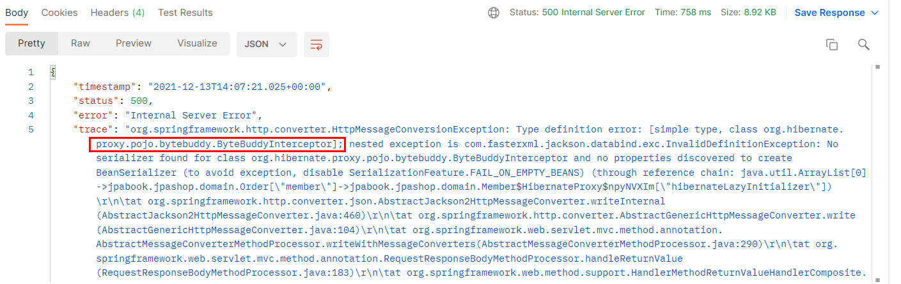
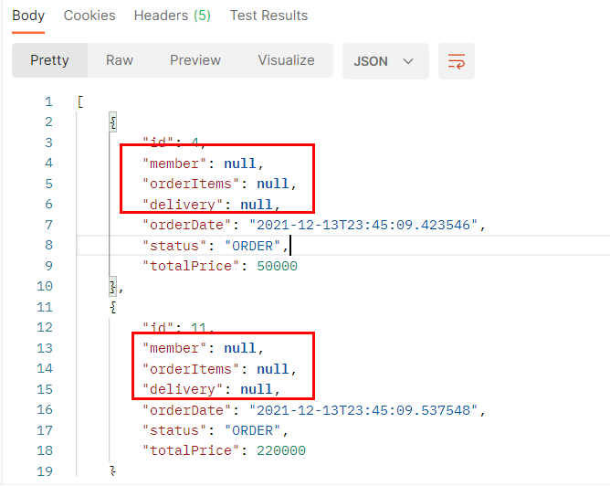
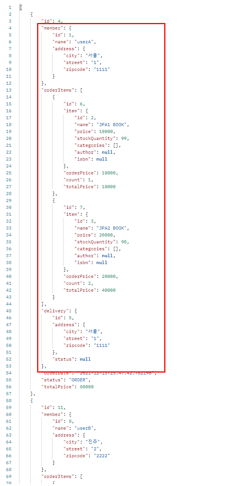
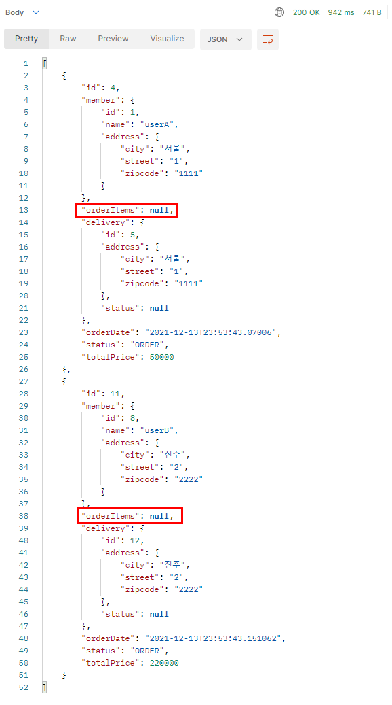
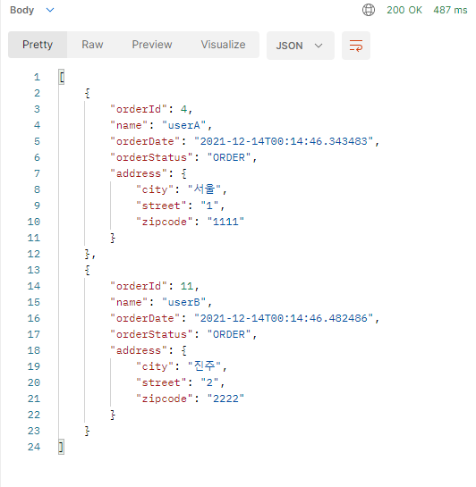
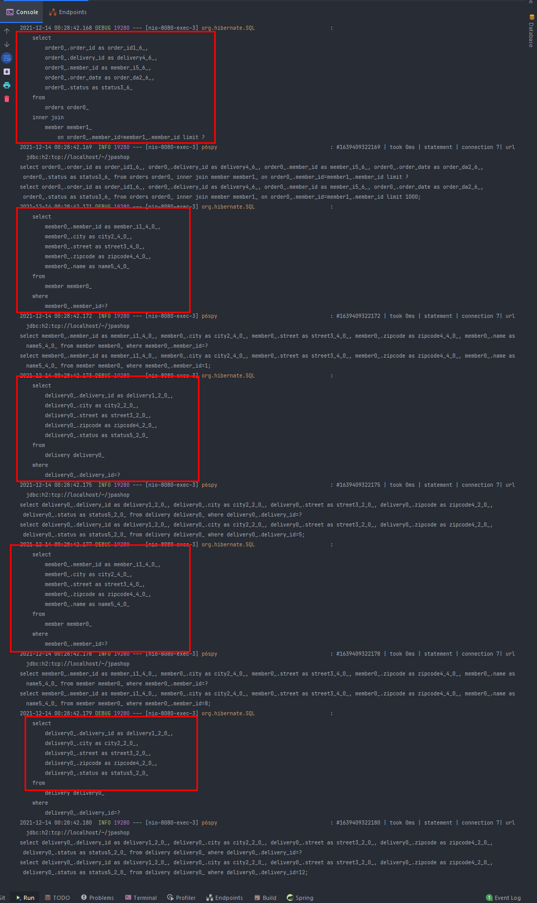
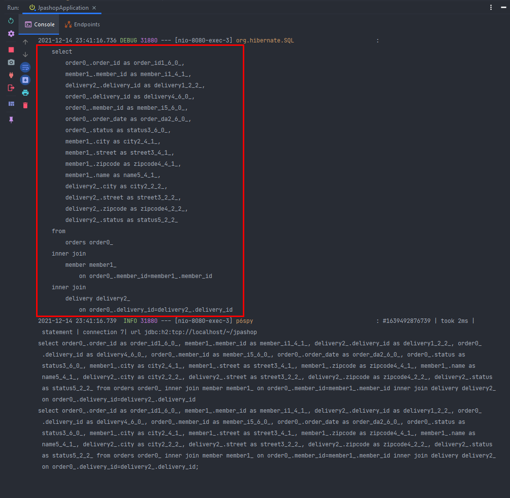
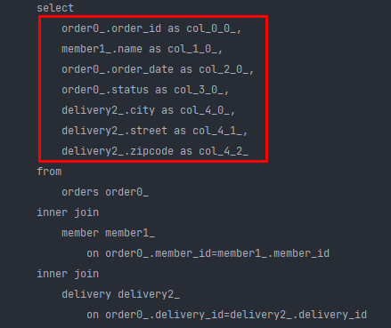
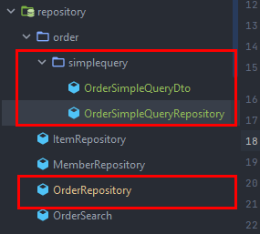

# section 3. API 개발 고급 - 지연 로딩과 조회 성능 최적화

주문 + 배송정보 + 회원을 조회하는 api 성능 최적화 하기

→ 이번에는 `XToOne 관계`에 대해 살펴 봄. (@ManyToOne, @OneToOne)

# 1. 간단한 주문 조회 V1: 엔티티를 직접 노출

```java
// order -> member -> order -> ... 무한 루프
@GetMapping("/api/v1/simple-orders")
public List<Order> ordersV1() {
	List<Order> all = orderRepository.findAllByString(new OrderSearch());
	return all;
}
```

무한 루프 돌지 않기 위해 Order와 연관되어 있는 Member, OrderItem, Delivery의 orders에 @JsonIgnore를 걸어야 함. (양방향 걸리는 곳에는 다 @JsonIgnore을 걸어야 함.)



이번에는 다른 에러가 발생함. → Order를 가져왔는데 Member가 지연 로딩이므로 가짜 프록시 멤버 객체를 생성해서 넣어져 있음. 그래서 이 바이트 버디 인터셉터가 프록시 기술로 들어가 있는데, 근데 jackson library가 order를 가지고 member에 접근해서 데이터를 뽑아내려고 했는데 멤버가 순수한 자바 객체가 아니라 프록시 객체여서 발생하는 에러임.

```java
@SpringBootApplication
public class JpashopApplication {

	public static void main(String[] args) {
		SpringApplication.run(JpashopApplication.class, args);
	}

	@Bean
	Hibernate5Module hibernate5Module() {
		return new Hibernate5Module();
	}
}
```

이렇게 지연 로딩인 경우에는 Hibernate5Module을 스프링 빈으로 등록하면 jackson에게 아예 프록시는 데이터를 뽑지 말라고 명령을 줄 수 있다. (build.gradle에 라이브러리 등록)



지연 로딩이 된 객체는 null로 들어온다.

```java
@SpringBootApplication
public class JpashopApplication {

	public static void main(String[] args) {
		SpringApplication.run(JpashopApplication.class, args);
	}

	@Bean
	Hibernate5Module hibernate5Module() {
		Hibernate5Module hibernate5Module = new Hibernate5Module();
		hibernate5Module.configure(Hibernate5Module.Feature.FORCE_LAZY_LOADING, true);
		return hibernate5Module;
	}
}
```

만약 다음과 같이 FORCE_LAZY_LOADING를 사용한다면 



즉시로딩으로 셋팅하기 때문에 값들을 가져올 수 있다.

하지만 위 처럼 엔티티를 노출 시키면, api 스펙상 내가 원하는 값만 가져올 수 없다. (예를 들면 order를 가져오면 member만 가져오고 싶은데 그와 연관된 orderitem, delivery까지 다 노출 됨)

그리고 이렇게 즉시로딩을 사용하게 되면 성능상의 문제 까지 발생하게 된다. (필요한 것 외에 나머지 필요없는것 까지 다 가져오기 때문)

Hibernate5Module에서 강제로 즉시 로딩하지 말고 다음과 같이 Lazy를 강제 로딩할 수 있다.

```java
@RestController
@RequiredArgsConstructor
public classOrderSimpleApiController {

private finalOrderRepository orderRepository;

// order -> member -> order -> ...무한 루프
@GetMapping("/api/v1/simple-orders")
publicList<Order> ordersV1() {
	List<Order> all = orderRepository.findAllByString(newOrderSearch());
		for(Order order : all) {
	    order.getMember().getName();// Lazy강제 초기화
			order.getDelivery().getAddress();// Lazy강제 초기화
		}
	
		returnall;
  }
}
```



이렇게 필요한 member, delivery만 강제 초기화 하고, orderItem은 숨길 수 있음.

근데 보통 api 스펙 설계할때 위 처럼 복잡하게 데이터를 주지 않는다. 멤버객체안의 모든 필드가 다 필요한게 아니라 멤버 이름만 필요한 경우가 대부분이기 때문이다.

> 결론은 엔티티를 외부에 노출 시켰을 때의 방안일 뿐, 실무에서는 외부에 노출 시키지 말고 DTO로 변환 시키자.
> 

> 주의: 지연 로딩(LAZY)을 피하기 위해 즉시 로딩(EARGR)으로 설정하면 안된다! 즉시 로딩 때문에 연관관계가 필요 없는 경우에도 데이터를 항상 조회해서 성능 문제가 발생할 수 있다. 즉시 로딩으로 설정하면 성능 튜닝이 매우 어려워 진다. 항상 지연 로딩을 기본으로 하고, 성능 최적화가 필요한 경우에는 페치 조인(fetch join)을 사용해라!(V3에서 설명)
> 

# 2. 간단한 주문 조회 V2: 엔티티를 DTO로 변환

```java
@GetMapping("/api/v2/simple-orders")
public List<SimpleOrderDto> ordersV2() {
	List<Order> orders = orderRepository.findAllByString(new OrderSearch());
	List<SimpleOrderDto> result = orders.stream()
		.map(o -> new SimpleOrderDto(o))
		.collect(Collectors.toList());

	return result;
}
```



아까보다 훨씬 깔끔한 api response를 만들어 낼 수 있다.

근데 v1과 v2 공통의 단점이 있는데, 쿼리를 너무 많이 날리는 단점이 있다.

order, member, delivery, 총 3개의 테이블을 건드려야 함 → 결과적으로 3개의 테이블을 조회해야 함. 



Order를 조회하기 위해 → SQL 1번 날림 → 현재 주문수는 2개

따라서 order 조회를 위한 sql 1번 → 멤버 조회 2번 + 배송정보 조회 2번 → 총 5번의 쿼리 나감.

즉 SQL1번 날렸을때, Order가 몇개(N)가 가져와지느냐에 따라 멤버와 배송정보가 n번씩 조회된다.

이게 바로 `N+1 문제`임.
(**여기서 멤버 조회를 2번했는데, 만약 이 두 멤버가 같다면, 처음에는 db에서 쿼리로 가져오지만, 2번째 부터는 캐시로 가져오기 때문에 이때는 쿼리가 1번만 나감 → 최악의 경우 N번 쿼리가 나감.**)

그렇다고 이걸 해결하려고 EAGER로 하려고 해도 안됨. 얘는 예측하기 힘듦.

order를 조회하려고 조회 쿼리를 날렸고 order를 까봤더니 member와 delivery가 EAGER로 설정 되있으면, 그 때부터 어떤 쿼리가 나갈 지 예측하기 너무 힘들어 짐.

→ 그래서 모든 연관관계는 다 LAZY로 둔다. 필요하면 fetch join을 쓴다.

# 3. 간단한 주문 조회 V3: 엔티티를 DTO로 변환 - 페치 조인 최적화

```java
@GetMapping("/api/v3/simple-orders")
public List<SimpleOrderDto> ordersV3() {
	List<Order> orders = orderRepository.findAllWithMemberDelivery();

	List<SimpleOrderDto> result = orders.stream()
		.map(o -> new SimpleOrderDto(o))
		.collect(Collectors.toList());

	return result;
}
```

```java
public List<Order> findAllWithMemberDelivery() {
	return em.createQuery(
		"select o from Order o" +
			" join fetch o.member m" +
			" join fetch o.delivery d", Order.class
	).getResultList();
}
```

fetch join을 해서 order를 조회할 때 member와 delivery를 다 join해서 한번에 가져온다. (지연로딩 무시하고 다 가져옴)



한방 쿼리로 주문, 멤버, 배송 정보 다 가져올 수 있다.

> 이 페치 조인은 `책`, `기본편` 100% 이해하고 실무에서 써먹을 수 있도록 하자.
> 

단 점이라면 select로 필드들을 다 가져온건데, 이거도 최적화 할 수 있다.

# 4. 간단한 주문 조회 V4: JPA에서 DTO로 바로 조회

위에서는 엔티티로 조회한 다음, DTO로 변환했는데, 이 과정 필요 없이 바로 JPA에서 DTO로 끄집어 내면 더 성능 최적화 할 수 있다.

```java
@GetMapping("/api/v4/simple-orders")
public List<OrderSimpleQueryDto> ordersV4() {
	return orderRepository.findOrderDtos();
}
```

```java
public List<OrderSimpleQueryDto> findOrderDtos() {
	return em.createQuery(
		"select new jpabook.jpashop.repository.OrderSimpleQueryDto(o) " +
			" from Order o" +
			" join o.member m" +
			" join o.delivery d", OrderSimpleQueryDto.class)
		.getResultList();
}
```

```java
public OrderSimpleQueryDto(Long orderId, String name, LocalDateTime orderDate, OrderStatus orderStatus, Address address) {
	this.orderId = orderId;
	this.name = name;
	this.orderDate = orderDate;
	this.orderStatus = orderStatus;
	this.address = address;
}
```

JPA는 기본적으로 entity나 value object만 반환할 수 있다. (+embeddable) 

dto를 반환 할 수는 없기 때문에 jpql에 new operation을 꼭 써줘야 한다.

여기서 jpa가 o를 반환할때 order reference값을 반환하는게 아니라 식별자 값을 반환하기 때문에 OrderSimpleQueryDto의 생성자 또한 Order가 아니라 필드들로 다 바꿔줘야 함. (Address 는 값 처럼 작용하기 때문에 파라미터로 넘겨줄 수 있음.)



이렇게 바로 dto로 가져오면 select할때 필요한 값만 가져다 쓸 수 있다.

> 필드를 많이 가져오면 그만큼 db에서 값을 많이 가져오고, 네트워크를 많이 쓰게 됨 (애플리 케이션 네트워크 용량 최적화 → 근데 생각보다 미비함)
> 

V3와 V4는 차이가 있음.

V3는 fetch join으로 내가 원하는 것만 select해옴. order를 건드리지 않고 내부 데이터들중 원하는것들만 가져오면서 성능 튜닝을 할 수 있었음.

근데 V4는 실제 sql 짜듯이 쭉 짜서 원하는 데이터를 가져온 거임.

그래서 V3와 달리 화면에는 최적화 되있지만 범용적으로 쓸 수 없음. (리포지토리의 재사용성이 떨어지고, API 스펙에 맞춘 코드가 리포지토리에 들어가는 것 또한 단점임 → API 스펙이 바뀌면 결국 이 리포지토리의 코드를 다 바꿔줘야 함.)

그리고 엔티티로 조회해 온게 아니므로 변경감지도 사용할 수 없음.

그리고 코드도 더 지저분함. 

하지만 V3보단 V4가 조금은 성능최적화 면에서 좋음.

⇒ V3과 V4의 각각의 장단점이 존재하므로 trade-off관계이고, 선택을 해야 함.

결론적으로는 필드 몇개를 더 select해온다고 해서 성능적으로 큰 이슈가 발생하지 않음 → 오히려 

join하거나 where절의 조건에서 index가 안먹히고 여기서 성능이 다 잡아먹힘

그래서 전체적인 애플리케이션 관점에서 필드 몇개 더가져오는거? 성능에 영향 거의 없음.

(물론 데이터가 엄청 많고, api 트래픽이 정말 많다면 고민은 해봐야 함 → 이게 아니고서는 왠만하면 영향 X) 

### V4의 단점 해결하기

이렇게 별도의 DTO를 만드는 성능 최적화용은 아예 패키지를 나눈다. (쿼리용 레포지토리를 새로 만든다)



OrderRepository는 순수한 엔티티 조회를 위한 내용만을 담고, 쿼리용 레포는 따로 패키지를 나눈다.

```java
@Repository
@RequiredArgsConstructor
public class OrderSimpleQueryRepository {

	private final EntityManager em;
	public List<OrderSimpleQueryDto> findOrderDtos() {
		return em.createQuery(
			"select new jpabook.jpashop.repository.order.simplequery.OrderSimpleQueryDto(o.id, m.name, o.orderDate, o.status, d.address) " +
				" from Order o" +
				" join o.member m" +
				" join o.delivery d", OrderSimpleQueryDto.class)
			.getResultList();
	}
}
```

OrderSimpleQueryRepository얘는 화면에 최적화 되어있는 내용을 담은 리포지토리임.

실무에서는 통계 api 등 복잡한 조인 쿼리를 써서 dto로 뽑아내야할 경우가 많다. 이럴때 쿼리 서비스, 쿼리 리포지토리로 뽑아내면 확실히 유지 보수성이 높아짐.

**쿼리 방식 선택 권장 순서**

1. 우선 엔티티를 DTO로 변환하는 방법을 선택한다. `(V2)`
2. 필요하면 페치 조인으로 성능을 최적화 한다. 대부분의 성능 이슈가 해결된다. `(V3)`
3. 그래도 안되면 DTO로 직접 조회하는 방법을 사용한다. `(V4)`
4. 최후의 방법은 JPA가 제공하는 네이티브 SQL이나 스프링 JDBC Template을 사용해서 SQL을 직접 사용한다.