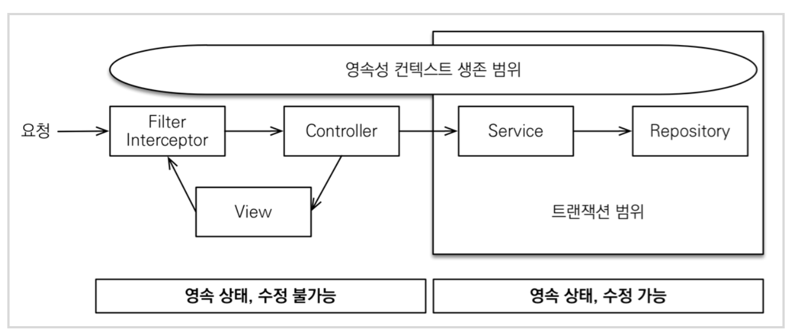
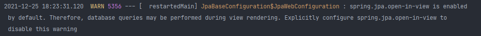
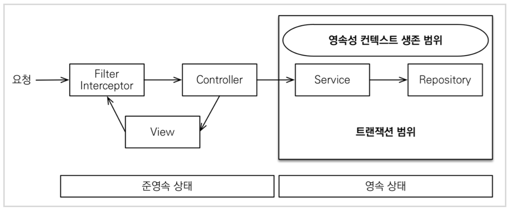
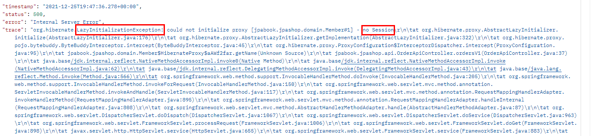
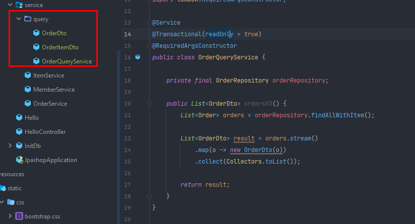

# section 5. API 개발 고급 - 실무 필수 최적화

# * OSIV와 성능 최적화

- Open Session In View : `하이버네이트`
- Open EntityManager In View : `JPA`

> JPA에서 EntityManager가, Hibernate에서는 Seesion임.
> 

## OSIV ON



- `spring.jpa.open-in-view` : true가 기본값임.

스프링 부트를 실행하면 처음에 Warning이 하나 뜬다.



spring.jpa.open-in-view 옵션에 대한 설명에 대해서 경고 로그를 날려준다.

OSIV를 이해하려면 JPA가 언제 데이터베이스 커넥션을 가져오고 언제 데이터베이스 커넥션을 db에 반환할지에 대한 내용을 알아야 한다.

JPA의 영속성 컨텍스트는 데이터베이스 커넥션을 내부적으로 사용하고 있어야 동작할 수 있다. 따라서 데이터베이스 커넥션과 영속성 컨텍스트는 굉장히 밀접한 연관이 있다.

**데이터베이스 트랜잭션이 시작할 때 JPA가 데이터베이스 커넥션을 가져온다.** (보통은 스프링의 service레이어에서 트랜잭션 시작할때 커넥션을 가져옴.)

그리고 이제 이 데이터 커넥션을 언제 db에 돌려주는지가 중요한데 이때 osiv 옵션이 켜져있느냐에 따라 달라짐. 

`**spring.jpa.open-in-view**` 가 기본적으로 켜져 있으면 서비스 레이어에서 트랜잭션이 끝나고 컨트롤러로 넘어가도 open session in view가 켜져 있으면 데이터 베이스 커넥션이 반환되지 않음. 

왜 반환을 안했냐면 지금 짠 로직들은 controller 레이어에서 레이지로딩을 시도하고 있음. 그래서 영속성 컨텍스트가 아직 데이터베이스 커넥션을 물고 살아 있어야 가능한 로직들이다.  

`**open session in view**`는 **트랜잭션이 끝나도 영속성 컨텍스트를 끝까지 살려둔다.** (api면 유저에게 response를 반환할 때까지 살려둠. 화면인 경우는 view 템플릿으로 화면이 렌더링 될때까지 살려둠 → 유저에게 완전히 response가 나갈 때 까지 데이터베이스 커넥션을 물고 있게 됨.

이거는 굉장히 큰 장점(엔티티를 활용해서 컨트롤러나 뷰에서 레이지로딩을 적극 활용할 수 있음 → 코드 유지보수도 가능해짐) 이라고 생각할 수 있는데, 실무에서 **장애**를 불러올 수 있음.

왜냐면 데이터 베이스 커넥션 리소스를 오래 사용하게 되면, 실시간 트래픽이 중요한 애플리케이션에서는 커넥션이 모자랄 수 있음. (**커넥션이 말랐다** 라고 표현함) ⇒ 장애로 이어짐.

예를 들면 컨트롤러에서 외부 API를 호출했는데 외부 API 대기시간이 3초라면, 그 3초동안 데이터베이스 커넥션 리소스를 반환하지 못하고 유지해야 한다. → 외부 API가 블로킹이라도 걸리면 데이터 베이스 커넥션이 쓰레드 풀 다 차버릴 때까지 먹어버리게 됨. → 장애 : `**OSIV 의 치명적인 단점!**`



- `spring.jpa.open-in-view` : false → OSIV 종료

OSIV를 끄면 트랜잭션을 종료할 때 영속성 컨텍스트를 닫고, 데이터베이스 커넥션도 반환한다. 따라서커넥션 리소스를 낭비하지 않는다.
OSIV를 끄면 모든 지연로딩을 트랜잭션 안에서 처리해야 한다. 따라서 지금까지 작성한 많은 지연 로딩 코드를 트랜잭션 안으로 넣어야 하는 단점이 있다. 그리고 view template에서 지연로딩이 동작하지 않는다. 결론적으로 트랜잭션이 끝나기 전에 지연 로딩을 강제로 호출해 두어야 한다.

```java
@GetMapping("/api/v1/orders")
public List<Order> ordersV1() {
	List<Order> all = orderRepository.findAllByString(new OrderSearch());
	for (Order order : all) {
		// Lazy 강제 초기화 (주문멤버, 주문주소, 주문아이템 -> 강제 초기화)
		order.getMember().getName();
		order.getDelivery().getAddress();
		List<OrderItem> orderItems = order.getOrderItems();
		orderItems.stream().forEach(o -> o.getItem().getName());
	}
	return all;
}
```

```java
spring:
  datasource:
    url: jdbc:h2:tcp://localhost/~/jpashop;
    username: sa
    password:
    driver-class-name: org.h2.Driver

  jpa:
    hibernate:
      ddl-auto: create
    properties:
      hibernate:
#        show_sql: true
        format_sql: true
        default_batch_fetch_size: 100
    open-in-view: false

logging:
  level:
    org.hibernate.SQL: debug
#    org.hibernate.type: trace
```

yml에서 open-in-view 옵션을 false로 하고 기존의 V1을 실행 시켜보면



멤버를 초기화 하지 못한다. 왜냐면 영속성 컨텍스트를 통해 프록시 초기화를 해야하는데, 컨트롤러에서 영속성컨텍스트가 없기 때문에 이런 예외가 터짐.

→ 해결 방법 : 트랜잭션 안에서 전부 로딩 해놔야 함. or 페치조인 사용?

이걸 해결하기 위한 구조적인 방법이 굉장히 많이 있음.

```java
private final OrderQueryService orderQueryService;
@GetMapping("/api/v3/dup/orders")
public List<jpabook.jpashop.service.query.OrderDto> ordersV3dup() {
	return orderQueryService.ordersV3();
}
```



트랜잭션안으로 코드를 옮겨야 하는데, 단순한 경우에는 그냥 OrderQueryService를 만든다. (쿼리용 서비스를 만든다. 화면에 맞춘 서비스다. 패키지는 핵심 비즈니스 로직과 분리하는게 좋다) 그리고 컨트롤러에서 수행한 변환 로직들을 여기다가 끌어 온다.

> 참고 : 도메인 별로 패키지가 분리 되어있다면 (member, order ...) 거기다가 쿼리용 서비스를 만들면 깔끔하다.
> 

그래서 위 처럼 코드를 분리하면 OSIV를 꺼도 지연로딩이 잘 동작함.

**이런식의 별도의 쿼리용 서비스를 만들어서 해결할 수 있음.**

### 커멘드와 쿼리 분리

실무에서 OSIV를 끈 상태로 복잡성을 관리하는 좋은 방법이 있다. 바로 Command와 Query를 분리하는 것이다.

> 참고: [https://en.wikipedia.org/wiki/Command–query_separation](https://en.wikipedia.org/wiki/Command%E2%80%93query_separation)
> 

보통 비즈니스 로직은 특정 엔티티 몇개를 등록하거나 수정하는 것이므로 성능이 크게 문제가 되지 않는다. 그런데 복잡한 화면을 출력하기 위한 쿼리는 화면에 맞추어 성능을 최적화 하는 것이 중요하다. 하지만 그 복잡성에 비해 핵심 비즈니스에 큰 영향을 주는 것은 아니다.

그래서 크고 복잡한 애플리케이션을 개발한다면, 이 둘의 관심사를 명확하게 분리하는 선택은 유지보수 관점에서 충분히 의미 있다. (위에서 설명했 듯 OrderQueryService를 따로 만들어서 분리할 수 있다.)

현업에서는 `컨트롤러 - 어플리케이션 서비스 - 도메인 서비스 - 리포지토리` 로 레이어를 한단계 늘려서 어떻게 처리할지 고민하기도 함.

> 참고 :  보통 고객 서비스의 실시간 API는 OSIV를 끄고, ADMIN 처럼 커넥션을 많이 사용하지 않는 곳에서는 OSIV를 켠다.