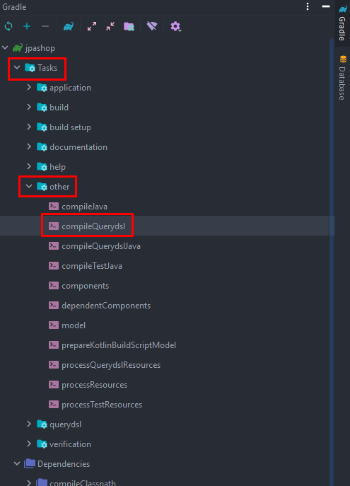

# section 6. 다음으로

# 1. 스프링 데이터 JPA 소개

```java
public interface MemberRepository extends JpaRepository<Member, Long> {
	List<Member> findByName(String name);
}
```

스프링 데이터 JPA는 `JpaRepository<엔티티, pk>` 를 상속받고 멤버 리포지토리에 구현체를 스프링이 주입해 준다. ⇒ 우리가 구현한 findOne, findAll 같은 왠만한 내용들이 다 구현되어 있음.

> 참고 : SpringDataJpa에서는 findOne() → findById()로 변경해야 함.
> 

- 스프링 데이터 JPA는 `**JpaRepository**` 라는 인터페이스를 제공하는데, 여기에 기본적인 CRUD 기능이
모두 제공된다. (일반적으로 상상할 수 있는 모든 기능이 다 포함되어 있다.)
- `**findByName`** 처럼 일반화 하기 어려운 기능도 메서드 이름으로 정확한 JPQL 쿼리를 실행한다.
    - `**select m from Member m where m.name = :name**`
- 개발자는 인터페이스만 만들면 된다. 구현체는 스프링 데이터 JPA가 애플리케이션 실행시점에 주입해준다.

스프링 데이터 JPA는 스프링과 JPA를 활용해서 애플리케이션을 만들때 정말 편리한 기능을 많이
제공한다. 단순히 편리함을 넘어서 때로는 마법을 부리는 것 같을 정도로 놀라운 개발 생산성의 세계로 우리를 이끌어 준다.
하지만 **스프링 데이터 JPA는 JPA를 사용해서 이런 기능을 제공할 뿐이다. 결국 JPA 자체를 잘 이해하는것이 가장 중요**하다.

# 2. QueryDSL 소개

```yaml
//빌드할 때 큐 파일 생성을 위함.플러그인을 받을 수 있게 dependencies를 넣어 준다.
buildscript {
   dependencies {
      classpath("gradle.plugin.com.ewerk.gradle.plugins:querydsl-plugin:1.0.10")
   }
}

plugins {
   id 'org.springframework.boot' version '2.6.0'
   id 'io.spring.dependency-management' version '1.0.11.RELEASE'
   id 'java'
// querydsl plugin등록
id "com.ewerk.gradle.plugins.querydsl" version "1.0.10"
}

...

dependencies {
   ...

	 // querydsl라이브러리 등록
	 implementation 'com.querydsl:querydsl-jpa'
   implementation 'com.querydsl:querydsl-apt'

}

...

// querydsl추가 (generate된 q파일 등록할 위치 지정)
// defquerydslDir = 'src/main/generated' // <- 무슨 이유인지 얘는 안됨.
def querydslDir = "$buildDir/generated/querydsl"

querydsl {
   library = "com.querydsl:querydsl-apt"
   jpa =true
querydslSourcesDir = querydslDir
}

sourceSets {
   main {
      java {
         srcDirs = ['src/main/java', querydslDir]
      }
   }
}

compileQuerydsl {
   options.annotationProcessorPath = configurations.querydsl
}

configurations {
   querydsl.extendsFrom compileClasspath
}
```

build.gradle에 querydsl을 위한 내용들을 추가한다.



그리고 gradle의 tasks에서 compileQuerydsl을 실행시키면 


main 폴더 밑에 generated 라는 폴더가 생기고

Q가 붙은 클래스가 나온다. QMember를 예시로 보면

```java
/**
 * QMember is a Querydsl query type for Member
 */
@Generated("com.querydsl.codegen.DefaultEntitySerializer")
public class QMember extends EntityPathBase<Member> {

    private static final long serialVersionUID = -571917283L;

    private static final PathInits INITS = PathInits.DIRECT2;

    public static final QMember member = new QMember("member1");

    public final QAddress address;

    public final NumberPath<Long> id = createNumber("id", Long.class);

    public final StringPath name = createString("name");

    public final ListPath<Order, QOrder> orders = this.<Order, QOrder>createList("orders", Order.class, QOrder.class, PathInits.DIRECT2);

    public QMember(String variable) {
        this(Member.class, forVariable(variable), INITS);
    }

    public QMember(Path<? extends Member> path) {
        this(path.getType(), path.getMetadata(), PathInits.getFor(path.getMetadata(), INITS));
    }

    public QMember(PathMetadata metadata) {
        this(metadata, PathInits.getFor(metadata, INITS));
    }

    public QMember(PathMetadata metadata, PathInits inits) {
        this(Member.class, metadata, inits);
    }

    public QMember(Class<? extends Member> type, PathMetadata metadata, PathInits inits) {
        super(type, metadata, inits);
        this.address = inits.isInitialized("address") ? new QAddress(forProperty("address")) : null;
    }

}
```

이런 클래스 파일이 만들어지는데, 이걸 가지고 쿼리를 짜는거다.

```java
public List<Order> findAll(OrderSearch orderSearch) {
		QOrder order = QOrder.order;
		QMember member = QMember.member;

		JPAQueryFactory query = new JPAQueryFactory(em);
		return query
			.select(order)
			.from(order)
			.join(order.member, member) //order의 member와 join함. 2번째 인자는 alias로 member를 준다는 의미
			.where(statusEq(orderSearch.getOrderStatus()), nameLike(orderSearch.getMemberName()))
			.limit(1000)
			.fetch();
	}

	private BooleanExpression nameLike(String memberName) {
		if (!StringUtils.hasText(memberName)) {
			return null;
		}
		return QMember.member.name.like(memberName);
	}

	private BooleanExpression statusEq(OrderStatus statusCond) {
		if (statusCond == null) {
			return null;
		}
		return QOrder.order.status.eq(statusCond);
	}
```

예를들어 findAll을 구현하면 우선 QOrder와 QMember를 가져와야 한다. 그리고 JPAQueryFactory를 생성자 파라미터로 엔티티 매니저를 넘겨준다.

그리고 쿼리를 짜면, 굉장히 쉽게 쿼리를 구현할 수있다. (JPQL이랑 다를게 없음)

⇒ 코드만 봐도 굉장히 직관적으로 이해할 수 있음.

그리고 where절에 조건을 넣을 때는 querydsl에서 제공하는 BooleanExpression을 import 해서 메서드를 구현한다. (cond에서 null로 넘어오면 에러가 발생하지않고 where가 아예 안쓰기 때문에 사용 가능한 로직이다. → 굉장히 심플하게 짤 수 있게 됨.) 

⇒ 그냥 where절에 바로order.status.eq(orderSearch.getOrderStatus())를 넣어도 되지만 동적 쿼리를 위해 메서드로 뺌.

또 where (?,?) 이렇게 여러개 파라미터 넘기면 and 로 조건이 이어진다.

이렇게 짜면 장점이 100% 자바 코드이기 때문에 오타가 발생해도 컴파일 시점에 다 잡아낼 수 있다. **(어마어마한 장점!)**

> 참고 : generated된 패키지는 git에 push 하면 안됨. gitignore로 등록해 두자.
> 

```java
@Repository
public class OrderRepository {
	
	private final EntityManager em;
	private final JPAQueryFactory query;
	
	public OrderRepository(EntityManager em) {
		this.em = em;
		this.query = new JPAQueryFactory(em);
	}

	...
	
	public List<Order> findAll(OrderSearch orderSearch) {
		// QOrder와 QMember는 import static으로 불필요한 코드 제거 가능.
		//QOrder order = QOrder.order;
		//QMember member = QMember.member;
	
		// JPAQueryFactory도 클래스 인스턴스 변수로 주입받아서 사용하면 이 코드 제거 가능.
		// JPAQueryFactory query = new JPAQueryFactory(em); 
		return query
			.select(order)
			.from(order)
			.join(order.member, member) //order의 member와 join함. 2번째 인자는 alias로 member를 준다는 의미
			.where(statusEq(orderSearch.getOrderStatus()), nameLike(orderSearch.getMemberName()))
			.limit(1000)
			.fetch();
	}
}
```

이렇게 static과 DI를 이용하여 코드를 간결히 줄일 수 있다.

```java
private Map<Long, List<OrderItemQueryDto>> findOrderItemMap(List<Long> orderIds) {
		List<OrderItemQueryDto> orderItems = em.createQuery(
			"select new jpabook.jpashop.repository.order.query.OrderItemQueryDto(oi.order.id, i.name, oi.orderPrice, oi.count)"
				+ // oi.order.id 에서 사실 orderItem에 order_id fk가 있어서 참조를 하진 않음.
				" from OrderItem oi" +
				" join oi.item i" +
				" where oi.order.id in :orderId", OrderItemQueryDto.class)
			.setParameter("orderId", orderIds)
			.getResultList();

		// 성능 최적화를 위해 List인 orderItems를 map으로 바꿔 준다.
		Map<Long, List<OrderItemQueryDto>> orderItemMap = orderItems.stream()
			.collect(Collectors.groupingBy(orderItemQueryDto -> orderItemQueryDto.getOrderId()));
		return orderItemMap;
	}
```

또, 전에 DTO로 값 가져올 때 JPQL로 new Operation을 써서 패키지 별로 다 긁어왔는데, QueryDSL을 통해서 이 코드를 줄일 수 있다. ⇒ select 절에서 DTO를 가져올 때, 훨씬 깔끔하도록 만들어 줌.

### 정리

Querydsl은 SQL(JPQL)과 모양이 유사하면서 자바 코드로 동적 쿼리를 편리하게 생성할 수 있다.

실무에서는 복잡한 동적 쿼리를 많이 사용하게 되는데, 이때 Querydsl을 사용하면 높은 개발 생산성을 얻으면서 동시에 쿼리 오류를 컴파일 시점에 빠르게 잡을 수 있다.
꼭 동적 쿼리가 아니라 정적 쿼리인 경우에도 다음과 같은 이유로 Querydsl을 사용하는 것이 좋다.

**장점**

- 직관적인 문법
- 컴파일 시점에 빠른 문법 오류 발견
- 코드 자동완성
- 코드 재사용(자바 코드!)
- JPQL new 명령어와는 비교가 안될 정도로 깔끔한 DTO 조회를 지원한다.

Querydsl은 JPQL을 코드로 만드는 빌더 역할을 할 뿐임. 따라서 JPQL을 잘 이해하면 금방 배울 수
있다.

**Querydsl은 JPA로 애플리케이션을 개발 할 때 선택이 아닌 필수!**